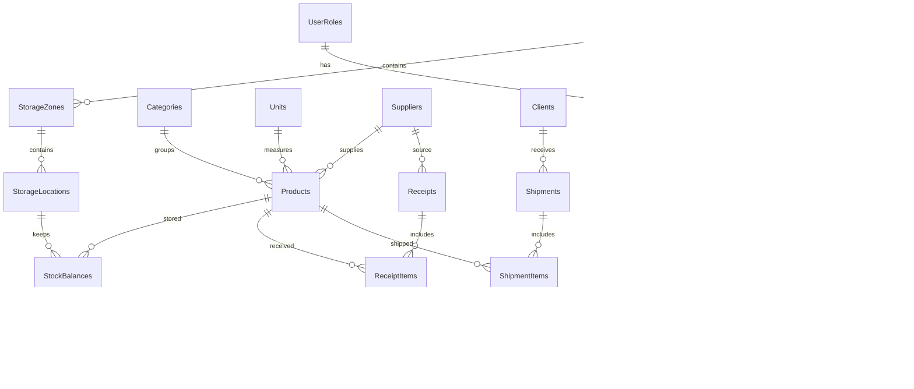

# ER-диаграмма

```mermaid
erDiagram
  UserRoles ||--o{ Users : has
  Employees ||--o{ Users : linked
  Categories ||--o{ Products : groups
  Units ||--o{ Products : measures
  Suppliers ||--o{ Products : supplies
  Suppliers ||--o{ Receipts : source
  Clients ||--o{ Shipments : receives
  Warehouses ||--o{ StorageZones : contains
  StorageZones ||--o{ StorageLocations : contains
  Products ||--o{ StockBalances : stored
  StorageLocations ||--o{ StockBalances : keeps
  Receipts ||--o{ ReceiptItems : includes
  Products ||--o{ ReceiptItems : received
  Shipments ||--o{ ShipmentItems : includes
  Products ||--o{ ShipmentItems : shipped
  Warehouses ||--o{ Inventories : checked
  Inventories ||--o{ InventoryResults : contains
  StockBalances ||--o{ InventoryResults : checked
  Users ||--o{ ActionLogs : writes
```
